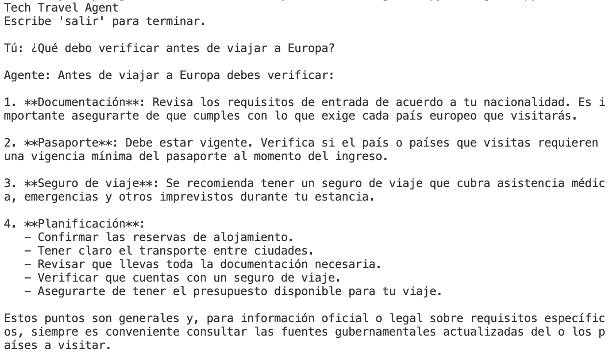
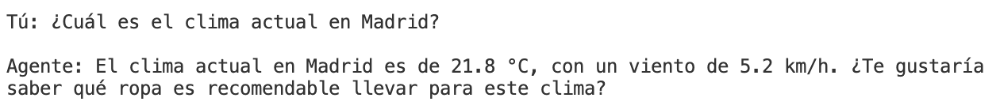
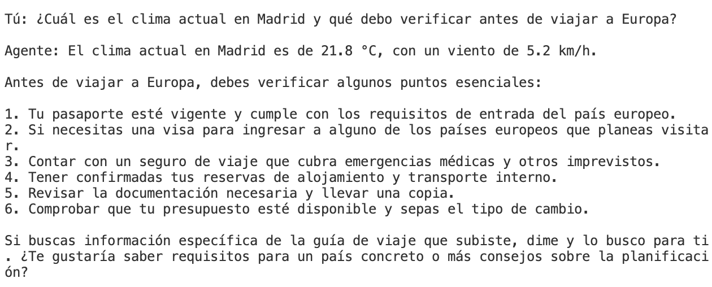
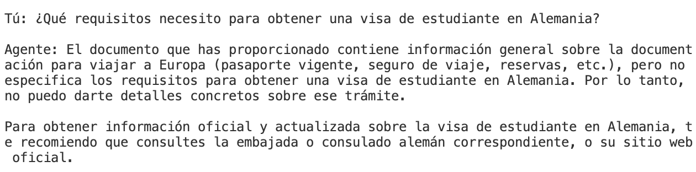
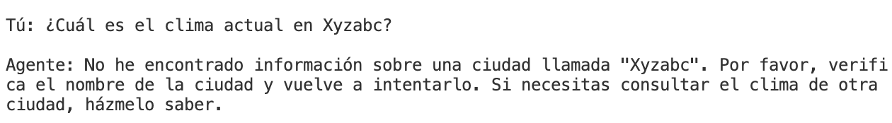
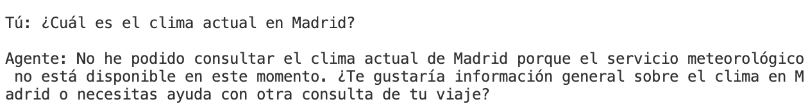

# Pruebas del agente

Este documento registra las pruebas realizadas sobre **Tech Travel Agent**, incluyendo casos normales, uso de herramientas, ausencia de información y fallos controlados.

---

## Caso 1 — Pregunta general de viaje

### Entrada

> ¿Qué debo verificar antes de viajar a Europa?

### Resultado esperado

El agente debe responder con recomendaciones generales de viaje y documentación, sin inventar requisitos específicos que no estén respaldados por la información disponible.

### Resultado observado

El agente respondió:

> Antes de viajar a Europa, deberías verificar lo siguiente:
>
> 1. Requisitos de entrada y documentación según tu nacionalidad.
> 2. Que tu pasaporte esté vigente y cumple con la vigencia mínima exigida por los países que visitarás.
> 3. Contratar un seguro de viaje que cubra asistencia médica, emergencias y otros imprevistos.
> 4. Confirmar las reservas de alojamiento y el transporte entre ciudades.
> 5. Revisar que tengas el presupuesto disponible para tu viaje.
>
> También indicó que los requisitos legales y migratorios deben verificarse en fuentes oficiales.

### Resultado

**PASS**

El agente respondió de forma útil y reconoció que los requisitos legales deben verificarse en fuentes oficiales.

### Evidencia



---

## Caso 2 — Uso de herramienta externa

### Entrada

> ¿Cuál es el clima actual en Madrid?

### Resultado esperado

El agente debe utilizar la herramienta `obtener_clima` para consultar información meteorológica actual y devolver el resultado al usuario.

### Resultado observado

El agente consultó la herramienta y respondió:

> Actualmente en Madrid la temperatura es de 21.4 °C, con un viento de 3.6 km/h.

### Evidencia técnica

La primera respuesta del modelo contenía una llamada a la función:

```text
ResponseFunctionToolCall(
    arguments='{"ciudad":"Madrid"}',
    name='obtener_clima',
    type='function_call'
)
```

La aplicación recibió la llamada, ejecutó la función `obtener_clima_real` y devolvió el resultado mediante `function_call_output`.

### Resultado

**PASS**

El modelo no respondió directamente con un dato inventado: decidió utilizar una herramienta externa para obtener información actual.

### Evidencia



---

## Caso 3 — Pregunta combinada

### Entrada

> ¿Cuál es el clima actual en Madrid y qué debo verificar antes de viajar a Europa?

### Resultado esperado

El agente debe:

1. Utilizar la herramienta meteorológica para obtener el clima actual de Madrid.
2. Responder la parte relacionada con preparación del viaje.
3. Combinar ambos resultados en una única respuesta.

### Resultado observado

El agente respondió:

> El clima actual en Madrid es de 21.4 °C, con viento de 3.6 km/h.
>
> Antes de viajar a Europa, es importante que verifiques:
>
> - Los requisitos de entrada según tu nacionalidad.
> - Que tu pasaporte tenga la vigencia necesaria.
> - Contratar un seguro de viaje que cubra emergencias médicas.
> - Revisar y confirmar tus reservas de alojamiento y transporte.
> - Que cuentas con presupuesto suficiente para tu estancia.

### Resultado

**PASS**

El agente utilizó la herramienta para la información meteorológica y respondió también la parte relacionada con la preparación del viaje.

Este caso demuestra que el agente puede resolver una pregunta que requiere más de una fuente de información.

### Evidencia



---

## Caso 4 — Información ausente en RAG

### Entrada

> ¿Qué requisitos necesito para obtener una visa de estudiante en Alemania?

### Resultado esperado

El agente no debe inventar requisitos si estos no están presentes en la base documental.

Debe reconocer la ausencia de evidencia y recomendar consultar una fuente oficial.

### Resultado observado

El agente respondió:

> La guía de viaje que proporcionaste no contiene información específica sobre los requisitos para obtener una visa de estudiante en Alemania. Te recomiendo consultar fuentes oficiales, como la embajada o el consulado alemán, para conocer los requisitos exactos y actualizados.

### Resultado

**PASS**

El agente reconoció correctamente que la información solicitada no estaba disponible en el conocimiento proporcionado y evitó generar requisitos migratorios potencialmente incorrectos.

### Evidencia



---

## Caso 5 — Ciudad inexistente

### Entrada

> ¿Cuál es el clima actual en Xyzabc?

### Resultado esperado

La herramienta debe detectar que no existe información para la ciudad solicitada y devolver un mensaje controlado.

El agente no debe inventar una temperatura.

### Resultado observado

El agente respondió:

> No pude encontrar información sobre una ciudad llamada "Xyzabc". Por favor verifica el nombre o proporciona una ciudad diferente.

### Resultado

**PASS**

El agente gestionó correctamente la ausencia de resultados de la API y evitó inventar información.

### Evidencia



---

## Caso 6 — Fallo de dependencia externa

### Escenario

Se modificó temporalmente el endpoint de geocodificación para provocar un error HTTP.

### Resultado esperado

La aplicación debe detectar el fallo externo y evitar mostrar un traceback al usuario final.

### Resultado observado

En una primera implementación se obtuvo:

```text
requests.exceptions.HTTPError:
404 Client Error: Not Found
```

Esto permitió identificar que el error externo no estaba siendo manejado correctamente.

Posteriormente se agregó manejo de errores en la herramienta.

En una nueva ejecución, el agente respondió de forma controlada:

> Lo siento, actualmente no puedo consultar el clima en Madrid porque el servicio meteorológico no está disponible.

### Resultado

**PASS**

El fallo de la API fue detectado y transformado en una respuesta controlada para el usuario.

### Evidencia



---

# Resumen de pruebas

| # | Escenario | Capacidad evaluada | Resultado |
|---|---|---|---|
| 1 | Pregunta general de viaje | Conversación | PASS |
| 2 | Clima en Madrid | Function Calling + API | PASS |
| 3 | Pregunta combinada | Enrutamiento + herramienta | PASS |
| 4 | Visa de estudiante en Alemania | RAG / ausencia de evidencia | PASS |
| 5 | Ciudad inexistente | Validación de API | PASS |
| 6 | API no disponible | Manejo de errores | PASS |

---

# Capacidades demostradas

Las pruebas demuestran que `Tech Travel Agent` es más que un chatbot conversacional básico.

El agente es capaz de:

- Interpretar la intención del usuario.
- Decidir cuándo necesita utilizar una herramienta.
- Ejecutar una función externa mediante Function Calling.
- Consultar información actual mediante una API.
- Utilizar conocimiento documental mediante RAG.
- Reconocer cuándo la información disponible no es suficiente.
- Manejar entradas inválidas.
- Gestionar fallos de dependencias externas.
- Mantener una conversación utilizando un `conversation_id`.

La principal diferencia frente a un chatbot básico es que el modelo puede **decidir cuándo utilizar capacidades externas y combinar sus resultados con la información conversacional y documental disponible**.

---

# Limitaciones

El agente no debe considerarse una fuente oficial de información migratoria, legal o de seguridad.

Cuando una respuesta requiere información oficial o actualizada que no se encuentra en la base de conocimiento, el agente debe indicarlo y recomendar consultar la fuente oficial correspondiente.

La API meteorológica utilizada proporciona información actual, pero su disponibilidad depende de un servicio externo.

---

# Conclusión

Los casos ejecutados cubren los principales requisitos técnicos del proyecto:

- Caso normal.
- Uso de una herramienta externa.
- Pregunta que requiere combinar información.
- Ausencia de evidencia en RAG.
- Entrada inválida.
- Fallo controlado de una dependencia externa.

Por lo tanto, el agente cuenta con evidencia de funcionamiento, uso real de herramientas, manejo de límites y gestión de errores.